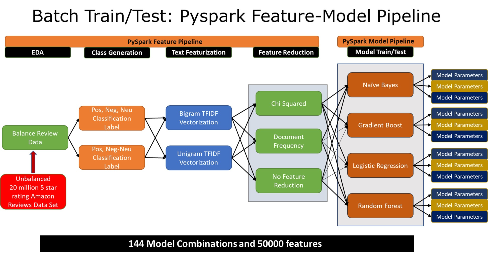
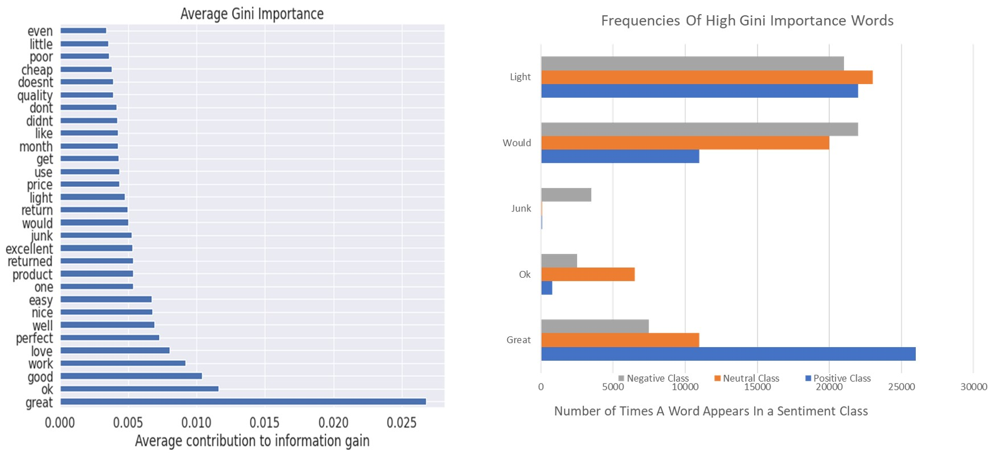

#  Gigabyte scale Amazon Product Reviews Sentiment Analysis Challenge: A scalable pySPARK NLP Machine Learning Pipeline hosted on AWS EMR Cloud
This project implements the Amazon Web Services (AWS) cloud deployment of big data train/test pipeline of gigabyte scale data using parallelized Natural Language Processing (NLP) machine learning algorithms to analyze the sentiment of Amazon product reviews using the AWS elastic map reduce architecture. The fully automated object oriented code was implemented using pySpark machine learning and pySpark SQL libraries. Prior to building the big data solution, I did extensive data cleaning, feature engineering, data visualization, and built prototype models to investigate the underlying data using sci-kit learn and seaborn. The details of the prototype model can be found in the /prototype/prototype.ipynb notebook.

Data Source:
Amazon Review Data (2018) was sourced from deepyeti.ucsd.edu/jianmo/amazon/index.html

The per category review data was unzipped and stored in the Amazon S3 bucket. A total of 10 GB of data and 20 million reviews were used.

Feature Data Pipeline:

Three class labels were generated for the positive, negative, and neutral classes. For the two class labels, positive and neutral/negative labels were used.

The feature data was processed using the pySpark feature pipeline shown in the illustration below:

The following AWS architecture was launched to run the pySpark feature pipeline and machine learning models: 

A total of 12 cluster nodes were used to deploy the above pipeline. The big data model yielded better performance compared to the baseline prototype model. This model can be scaled up to handle larger chunks of data by allocating more cluster nodes in the launch cluster script depending on the user requirements.

Results:

For the three class label case, the following results were obtained for the best case Logistic Regression + TFIDF model:

81% Precision Positive Sentiment Class,
72% Precision For Negative Sentiment Class,
55% Precision For Neutral Sentiment Class

The low precision for the neutral class can be explained by the classification of the neutral positive text as positive or the neutral negative text as negative.
This phenomenon can be further understood by exploring the feature importances of neutral words with high gini coefficients. In the graphs below we observe that the word 'would'
which is equally likely to occur in the positive, negative, neutral class can be misclassified as positive if positive sounding text like 'would have' had occured or as negative if 'would not' occured.

However, if the best case logistic Regression + TFIDF model was trained only on the positive and negative classes, we get a positive class precision of 92% and a negative class precision of 83%. This further confirms the hypothesis that neutral class data which is neutral-positive in character can be classified as positive or neutral-negative sounding text can be misclassified as negative.

Tech Stack Used:

AWS (S3 bucket, boto3, Dynamo DB, PySpark EMR), Yarn, hadoop

Scikit-learn, seaborn, python, pySpark ML, pySpark SQL, Numpy, Pandas, NLTK-NLP

Notes:

The instructions to launch the AWS EMR cluster and execute the code are under /scripts/AWS_EMR_Configure_Instructions.

The source files are under /src/

The prototype model Jupyter Notebook can be found in the folder /prototype/
